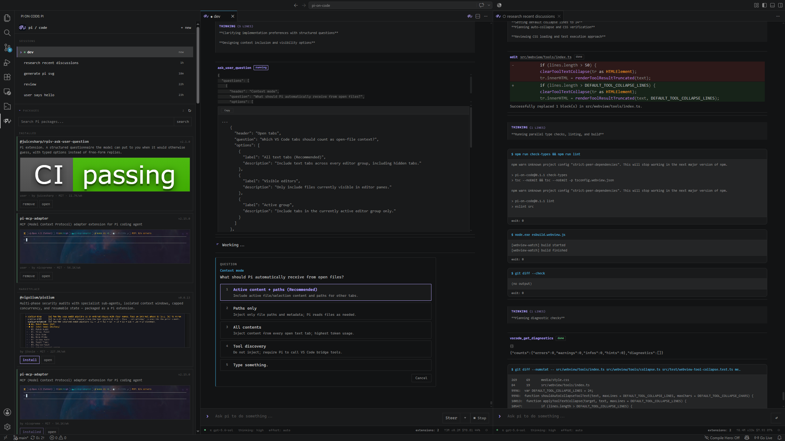
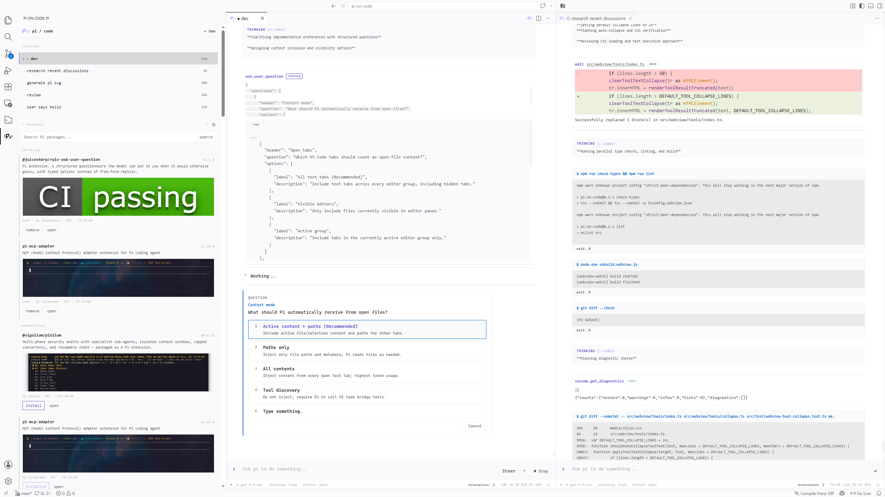
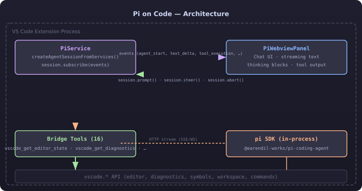

# Pi on Code

Pi on Code is a Pi-native coding-agent extension for VS Code. It brings Pi's
sessions, package ecosystem, extension runtime, and agent workflow into a
first-class editor workspace instead of wrapping them in a generic chat UI.

It combines persistent multi-session conversations, rich streaming tool
output, Package and Extension management, and direct access to VS Code code
intelligence. The interface follows Pi's compact terminal-inspired visual
language while supporting both dark and light editor themes.

## Screenshots

### Dark theme



### Light theme



## Features

- Run real Pi agent sessions in VS Code while keeping compatibility with Pi's
  standard settings, Packages, and JSONL session files.
- Work across multiple persistent sessions with independent models and
  thinking levels; resume, switch, or delete sessions from the Activity Bar.
- Stream assistant text, thinking, tool calls, shell output, file previews,
  and diffs in a compact conversation view.
- Steer an active turn or queue, edit, reorder, and promote follow-up messages.
- Install and update Pi Packages, preview marketplace media, and enable or
  disable Session extensions without leaving the sidebar.
- Render extension questions and UI interactions directly inside the
  conversation.
- Give Pi access to editor diagnostics, symbols, definitions, references,
  workspace edits, open tabs, and other VS Code-native context.
- Track model, thinking, effort, context usage, active extensions, and agent
  activity without adding a separate conversation header.

## Requirements

- VS Code 1.118 or newer.
- Node.js 22 or newer.
- Pi coding agent 0.80.8 through 0.82.1 (current verified compatibility
  range).

Pi 0.80.8 is the minimum supported release because Pi on Code uses the
`ModelRuntime`-based SDK introduced in [Pi 0.80.8](https://pi.dev/news/releases/0.80.8).
The required Session, Extension Runner, Package Manager, and Settings APIs have
been verified through Pi 0.82.1. See the [Pi release notes](https://pi.dev/news)
for upstream changes.

Install the latest compatible Pi release globally:

```powershell
npm install -g --ignore-scripts @earendil-works/pi-coding-agent@0.82.1
```

Authenticate Pi from a terminal first, or run `Pi: Set Up API Key / Login` from
the Command Palette.

## Use

1. Install Pi on Code from its VSIX package.
2. Open a folder in VS Code.
3. Run `Pi: Code Agent` or press `Ctrl+Alt+I`.
4. Type a request and press Enter.

Useful shortcuts:

- `Enter`: steer or send
- `Alt+Enter`: queue a follow-up
- `Ctrl+L`: choose model
- `Ctrl+P`: cycle favorite models
- `Ctrl+/`: command picker

## Development

```powershell
bun install
bun run compile
bun run build
bun run install:vsix
```

`bun run build` checks types and lint, creates production bundles, and writes
`artifacts/pi-on-code-<version>.vsix`. `bun run install:vsix` force-installs
that generated package into VS Code. Press F5 in VS Code to launch the
Extension Development Host.

## Architecture

[](media/architecture.svg)

## Attribution

The SDK lifecycle, session persistence, VS Code bridge tools, event
translation, webview protocol, and packaging pipeline are adapted from
[Pi Code Gui](https://github.com/NimbleTronAI/pi-code-gui). Pi on Code
introduces its own product identity, multi-session workspace, integrated
Package and Extension experience, and a Pi-inspired visual system for light
and dark themes.

The inherited implementation is licensed under the MIT License. See the
`LICENSE` file in the project root.
